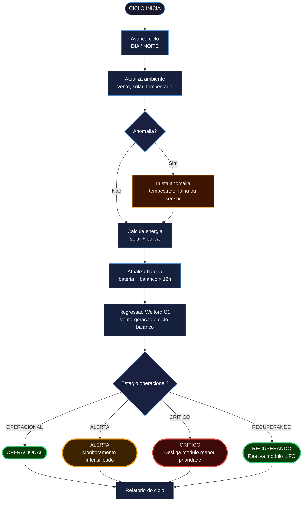

# ☄️ MGAB — Módulo de Gerenciamento Autônomo de Base


*Atividade Integradora · Fase 3 · Ciência da Computação, 2026 — FIAP*

🧑‍🚀 [Julia Ramos | RM568988](https://www.linkedin.com/in/juliaramosguedes) · [Matheus Fuchelberguer | RM569113](https://www.linkedin.com/in/matheus-fuchelberguer-neves/) · [Julio Joaquim | RM571321](https://github.com/jojigoats) · [Carlos Eugenio | RM570285](https://www.linkedin.com/in/carloseugenioandrade/)

---

   

MGAB — Módulo de Gerenciamento Autônomo de Base. A Aurora Siger entrou em operação contínua. A cada meio-sol marciano, o sistema calcula geração solar e eólica, monitora o consumo dos oito módulos ativos, prevê tendências de deterioração por regressão linear e toma decisões autônomas — desligando módulos não-essenciais quando a bateria entra em colapso e reativando-os em ordem inversa assim que o balanço se recupera.

> [!IMPORTANT]
> O desafio não é sobreviver — é manter a colônia funcionando de forma autônoma, estável e eficiente, sol após sol, mesmo quando Marte não coopera. Nenhuma intervenção humana é necessária para transitar entre os quatro estágios operacionais.

> [!CAUTION]
> Em `--stress`, uma tempestade global envolve a colônia desde o ciclo 1. Noites sem vento drenam a bateria antes do amanhecer. **Resistência é inútil.**

---

## 🛸 Pipeline

```
Cenário → Ambiente (dia/noite · vento · tempestade) → Anomalia opcional → Energia (solar + eólica − consumo) → Bateria → Regressão Welford → Decisão (4 estágios) → Relatório
```



<details>
<summary>🔬 Decisão por estágio — verificações em cadeia (cenário padrão)</summary>

<details>
<summary>OPERACIONAL — ciclo diurno nominal (ciclo 2)</summary>


</details>

<details>
<summary>ALERTA — balanço abaixo do limiar (ciclo diurno degradado)</summary>


</details>

<details>
<summary>ALERTA — previsão deteriorando antes do cruzamento</summary>


</details>

<details>
<summary>CRITICO — bateria esgotada, MIN-01 desligado</summary>


</details>

<details>
<summary>RECUPERANDO — bateria acima do mínimo, MIN-01 reativado (LIFO)</summary>


</details>

</details>

---

## 🛰 Arquitetura

**Funções puras** — sem efeitos colaterais; mesmo input sempre produz mesmo output. Cada estágio de decisão é testável individualmente — mandatório em sistemas de segurança crítica.

**Fonte única da verdade** — todos os limiares numéricos definidos uma vez em `src/constants.py`; reutilizados em energia, decisão e relatórios. Nenhum magic number no código.

**Separação estrita por responsabilidade** — `energy.py` calcula; `decision.py` decide; `report.py` exibe. Nenhum módulo conhece o funcionamento interno do outro.

**Regressão online** — Welford incremental: O(1) por ciclo, O(1) memória. Sem armazenamento de histórico — compatível com hardware embarcado de memória limitada.

**Seed fixo** — `RANDOM_SEED = 42` em `constants.py` garante reprodutibilidade total. Toda simulação é determinística e auditável — o mesmo cenário sempre produz o mesmo resultado.

**Acesso O(1)** — toda estrutura de dados usa tabela hash: `dict[str, Module]` explicitamente para coleções indexadas por chave dinâmica; dataclasses implicitamente via `__dict__` para registros de esquema fixo. Mesmo mecanismo, semântica diferente.

---

## O que é o MGAB

O MGAB é o sistema computacional integrado que gerencia a energia da colônia Aurora Siger.
A cada meio-sol marciano, ele calcula a geração solar e eólica, monitora o consumo de cada
módulo, prevê tendências de deterioração e toma decisões autônomas — desligando módulos
não-essenciais quando necessário e reativando-os assim que a situação melhora.

O sistema opera em quatro estágios: operacional, em alerta, crítico e recuperando.
Nenhuma intervenção humana é necessária para transitar entre eles.

---

## A colônia

Aurora Siger opera com uma tripulação de 6 pessoas, dimensionada segundo a NASA DRA 5.0
(Drake, 2009) e o estudo de energia marciana de Hartwick et al. (Nature Astronomy, 2023).

| # | Papel | Módulo primário |
|---|---|---|
| 1 | Commander | COM-01 Communications |
| 2 | Pilot | LOG-01 Logistics |
| 3 | Medical Officer | MED-01 Medical |
| 4 | Scientist | SCI-01 Science Lab |
| 5 | Engineer ECLSS | LSS-01 Life Support + HAB-01 Habitat |
| 6 | Engineer Power/ISRU | PWR-01 Power Systems + MIN-01 ISRU Mining |

6 é o mínimo seguro: garante um substituto treinado para cada expertise crítica.
Módulos críticos têm pessoa dedicada; nenhum módulo que pode matar é compartilhado.

### Módulos e prioridades

Todos os módulos operam 24h de forma autônoma. A literatura confirma: "life support
systems were controlled automatically" (CELSS, NIH 2019). Desligamentos são
exclusivamente por decisão energética — nunca por horário.

| Módulo | Prioridade | Consumo nominal |
|---|---|---|
| LSS-01 Life Support | 1 — nunca desliga | 14 kW |
| MED-01 Medical | 2 — essencial | 5 kW |
| HAB-01 Habitat | 3 — essencial | 7 kW |
| PWR-01 Power Systems | 4 — essencial | 4 kW |
| COM-01 Communications | 5 — operacional | 3 kW |
| SCI-01 Science Lab | 6 — operacional | 5 kW |
| LOG-01 Logistics | 7 — operacional | 3 kW |
| MIN-01 ISRU Mining | 8 — desliga primeiro | 5 kW |

**Consumo total: 46 kW** — dentro do range de 24–35 kW para sistemas críticos + 16 kW
de módulos operacionais. Fonte âncora: Hartwick et al. (2023), 24–35 kW para 6 pessoas.

---

## Infraestrutura energética

### Por que solar e eólica juntas?

Durante tempestades de areia, a geração solar cai até 85%. Quando o vento está forte,
as turbinas compensam. Quando o vento está fraco (noites calmas), a bateria cobre.
A combinação das três fontes é a arquitetura descrita por Hartwick et al. (2023).

### Localização

Aurora Siger está situada em um dos três melhores locais de geração eólica de Marte,
identificados por Hartwick et al. (Nature Astronomy, 2023). Nesses locais, a potência
eólica diurna média do E33 excede 24 kW em todos os momentos do ano simulado.

Selecionar o local com base em recurso energético é a metodologia recomendada pelo paper.

### Configuração instalada

| Componente | Quantidade | Especificação | Fonte |
|---|---|---|---|
| Painel solar | 1 × 1.000 m² | 29% eficiência | arXiv:2410.00066 |
| Turbinas eólicas | 2 × E33 (33,4 m) | ~24 kW nos melhores locais | Hartwick et al. (2023) |
| Baterias | 2 × 312 kWh | 80% DoD operacional | arXiv:2410.00066 |

A segunda turbina e a segunda bateria são redundância operacional — tolerância a falha simples.

### Balanço energético

| Período | Geração | Consumo | Balanço |
|---|---|---|---|
| Dia (nominal) | 145 kW solar + 48 kW eólica | 46 kW | +147 kW |
| Noite com vento | 0 + 20 kW eólica | 46 kW | −26 kW → 19,2h autonomia |
| Noite sem vento (70%) | 0 + 0 kW | 46 kW | −46 kW → 10,9h → **CRÍTICO** |
| Tempestade + vento | 22 kW solar + 48 kW | 46 kW | +24 kW — sistema aguenta |
| Tempestade + sem vento | 22 kW solar + 0 kW | 46 kW | −24 kW → CRÍTICO em ~20h |

---

## 📡 Modelos Matemáticos

| Fenômeno | Modelo | Tipo | Variável alimentada |
|---|---|---|---|
| Geração solar com poeira | `P = I × A × η × (1 − d)` | Linear | `solar_generation_kw` |
| Geração eólica (lei de Betz) | `P = ½ × ρ × Cp × A × v³` para `v ≥ v_cut` | Cúbica | `wind_generation_kw` |
| Atualização da bateria | `B(t) = clamp(B(t−1) + balanço × Δt, B_min, B_max)` | Linear | `battery_reserve_kwh` |
| Regressão linear (Welford) | `slope = C / S_xx`, `intercept = ȳ − slope × x̄` | Incremental O(1) | `cycle_to_balance`, `wind_to_generation` |

---

## 🌙 Estruturas de Dados

| Estrutura | Tipo | Papel |
|---|---|---|
| `alert_queue` | `deque[AlertEntry]` — FIFO | Hub de entrada de alertas por ciclo; nenhum alerta é descartado |
| `shutdown_stack` | `list[str]` — LIFO | Pilha de desligamentos para recuperação na ordem inversa |
| `energy_history` | `list[float]` — append-only | Histórico de balanço energético por ciclo — base do relatório final |
| `wind_history` | `list[float]` — append-only | Histórico de velocidade do vento por ciclo |
| `dust_history` | `list[float]` — append-only | Histórico de acumulação de poeira nos painéis |
| `OnlineRegression` | dataclass (estado Welford) | Acumuladores de regressão linear incremental — sem histórico armazenado |

---

## ⭐ Algoritmos

| Algoritmo | Uso | Complexidade | Justificativa |
|---|---|---|---|
| Welford incremental | Regressão linear online | O(1) por ciclo, O(1) memória | Sem armazenamento de histórico — compatível com hardware embarcado de memória limitada |
| Priority sort | Seleção do módulo a desligar | O(n log n) | Ordenação reversa por prioridade — garante que o menos crítico desliga primeiro |
| LIFO recovery | Reativação de módulos | O(1) | Lista como pilha — desfaz desligamentos na ordem inversa exata |
| Threshold extrapolation | Previsão de cruzamento de limiar | O(1) | Álgebra direta sobre os coeficientes: `ciclo_cruzamento = (limiar − b) / slope` |

---

## 🚀 Como executar

Sem dependências externas. Biblioteca padrão Python 3.13+.

| Argumento | Tipo | Default | Descrição |
|---|---|---|---|
| `--cycles` | inteiro | `48` | Número de ciclos a simular (cada ciclo ≈ meio sol marciano ≈ 12h) |
| `--random` | flag | ausente | Condições iniciais aleatórias dentro dos limites marcianos reais |
| `--anomaly` | decimal 0–1 | `0.0` | Probabilidade de anomalia por ciclo — tempestade, falha de equipamento ou erro de sensor |
| `--stress` | flag | ausente | Força tempestade global desde o ciclo 1 com anomalias em 15% dos ciclos. Default automático: 200 ciclos |

```bash
python main.py                              # cenário padrão, 48 ciclos
python main.py --cycles 96                 # número de ciclos customizado
python main.py --random                    # cenário aleatório
python main.py --anomaly 0.3               # 30% de chance de anomalia por ciclo
python main.py --random --anomaly 0.4      # aleatório com anomalias frequentes
python main.py --stress                    # tempestade global forçada, 200 ciclos
python main.py --stress --cycles 400       # tempestade global longa
```

> [!NOTE]
> O projeto não usa bibliotecas externas. Apenas Python 3.13+ padrão. Nenhuma instalação adicional necessária. Seed fixo `42` garante que toda simulação é reprodutível e auditável.

---

## Exemplo de saída

```
=================================================================
☄️ CICLO  39 [NOITE] — AURORA SIGER  [CRÍTICO]
   Resistência é inútil. Protocolo de emergência ativado.
=================================================================
🛰  Ambiente
   Vento: 6.0 m/s              Irradiância: NOITE
   ⚠  Tempestade de poeira — intensidade: 89%
⚡  Energia
   Bateria  [████░░░░░░░░░░░░░░░░]    115.3 kWh   18.5%  (CRÍTICO)
   Solar    [░░░░░░░░░░░░░░░░░░░░]      0.0 kW
   Eólica   [░░░░░░░░░░░░░░░░░░░░]      0.0 kW
   Consumo  [████████████████████]     46.0 kW  |  Balanço:    -46.0 kW
   Poeira   [███░░░░░░░░░░░░░░░░░]   14.8%
   Abrasão  [░░░░░░░░░░░░░░░░░░░░]    0.0%
🛰  Módulos ativos (7/8): LSS-01 Life Support, MED-01 Medical, HAB-01 Habitat, PWR-01 Power Systems, COM-01 Communications, SCI-01 Science Lab, LOG-01 Logistics
   Inativos: MIN-01 ISRU Mining
📡  Previsão (+6 ciclos): -12.6 kW  [→ estável]
🌙  Alertas (1):
   [DÉFICIT ENERGÉTICO] MIN-01 ISRU Mining desligado — bateria crítica: 115 kWh
```

---

## 🌌 Estrutura

```
fiap_fase_3_aurora_siger/
├── main.py                  ← entry point — CLI args, seed fixo, cenário
├── ENGINEERING_GUIDE.md     ← walkthrough técnico completo para engenheiros
├── src/
│   ├── constants.py         ← constantes físicas, limiares e controle de simulação
│   ├── enums.py             ← SystemStatus, AlertType, AnomalyType, ModuleName
│   ├── models.py            ← ColonyState, EnergyState, AlertEntry (TypedDict)
│   ├── alerts.py            ← enqueue_alert — fila de alertas tipada
│   ├── energy.py            ← modelos solar (irradiância) e eólico (Betz)
│   ├── forecast.py          ← regressão Welford incremental — O(1)
│   ├── decision.py          ← 4 estágios · desligamento por prioridade · manutenção
│   ├── scenarios.py         ← default_scenario(), random_scenario()
│   ├── simulation.py        ← run_simulation() · ambiente · injeção de anomalias
│   └── report.py            ← display_cycle_report(), display_final_report()
└── docs/
    ├── crew-and-energy-rationale.md
    ├── energy-reference.md
    ├── environment-reference.md
    ├── modules-reference.md
    └── thresholds-reference.md
```

---

## Critérios da atividade atendidos

| Critério | Implementação |
|---|---|
| Estruturação de dados | `ColonyState` hierárquico, `deque` para alertas FIFO, pilha LIFO para recuperação, dicionários de enumeração |
| Lógica de decisão | 4 estágios com condições explícitas, desligamento por prioridade, recuperação LIFO |
| Modelagem e previsão | Fórmulas físicas reais (Betz, irradiância solar); regressão Welford com previsão de cruzamento de limiar |
| Implementação Python | Funções puras, separação por módulo, sem bibliotecas externas |
| Documentação | README, ENGINEERING_GUIDE, `docs/`, constantes com fonte inline |

---

## 🔭 Referências

| Parâmetro | Fonte |
|---|---|
| Top-3 locais eólicos de Marte; 24 kW nos melhores locais | Hartwick et al. — *Nature Astronomy* (2023) |
| Composição da tripulação de 6 pessoas (DRA 5.0) | Drake — *NASA DRA 5.0* (2009) |
| Suporte de vida controlado automaticamente | *CELSS Study* — NIH (2019) |
| Automação ECLSS reduz tempo de manutenção regular | NASA ECLSS — NTRS 20230002103 |
| ISRU: modos de operação 24h e 8h (energia-driven) | *Space S&T* (2021) |
| Painel solar 29% eficiência; bateria 312 kWh × 2 | arXiv:2410.00066 |
| Vento noturno usualmente abaixo do cut-in (Viking Lander) | NASA — NTRS 19790057281 |
| Duração de tempestades regionais marcianas: 6–56 ciclos | *ScienceDirect* (2022) |
| Regressão linear incremental O(1) | Welford — *Technometrics* (1962) |
| Range de velocidade do vento marciano | NASA Planetary Data System — Viking Lander |

> [!NOTE]
> Consulte [`docs/energy-reference.md`](docs/energy-reference.md) para os limiares energéticos, [`docs/environment-reference.md`](docs/environment-reference.md) para os modelos ambientais e [`docs/modules-reference.md`](docs/modules-reference.md) para o consumo dos módulos.

---

> [!IMPORTANT]
> *"A lógica é o começo da sabedoria, não o fim."* 🖖

